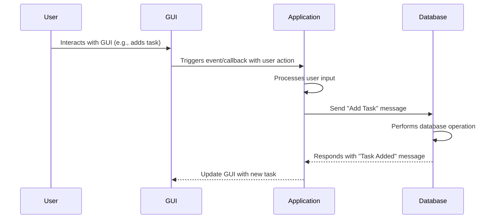

```mermaid
sequenceDiagram
    participant User as User
    participant GUI as GUI
    participant Application as Application
    participant Database as Database

    User ->> GUI: Interacts with GUI (e.g., adds task)
    GUI ->> Application: Triggers event/callback with user action
    Application ->> Application: Processes user input

    Application ->> Database: Send "Add Task" message
    Database ->> Database: Performs database operation
    Database -->> Application: Responds with "Task Added" message

    Application -->> GUI: Update GUI with new task
```